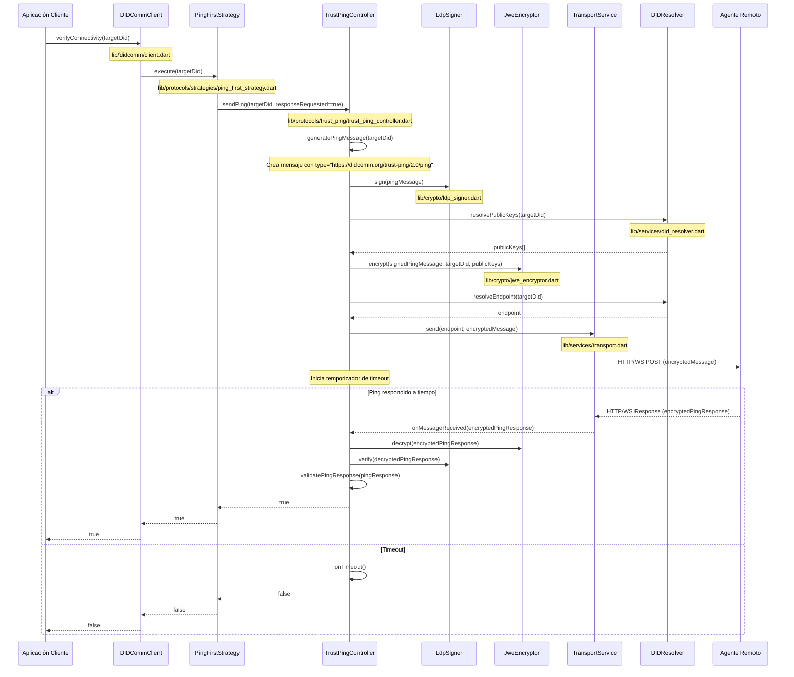
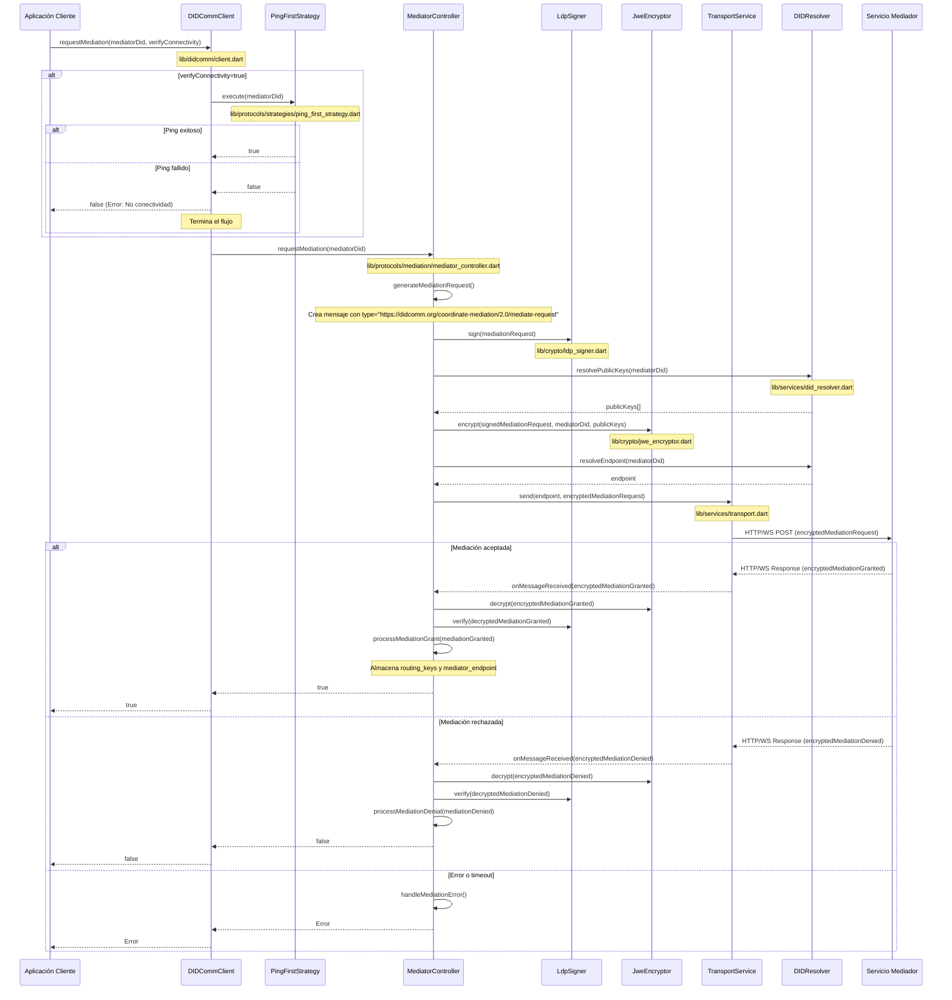

# Mapa de Flujo de Implementación DIDComm

## 1. Caso: Verificar Conectividad (Trust Ping 2.0)

### Archivos Involucrados:

1. **lib/didcomm.dart**
   - Punto de entrada público que expone DIDCommClient

2. **lib/didcomm/client.dart**
   - Implementa `DIDCommClient` con método `verifyConnectivity()`
   - Coordina las operaciones de alto nivel

3. **lib/protocols/strategies/ping_first_strategy.dart**
   - Implementa la estrategia de verificación de conectividad
   - Utiliza Trust Ping para comprobar si el destino está disponible

4. **lib/protocols/trust_ping/trust_ping_controller.dart**
   - Gestiona el protocolo Trust Ping 2.0
   - Genera, envía y procesa mensajes de ping
   - Maneja timeouts y eventos de respuesta

5. **lib/crypto/ldp_signer.dart**
   - Firma mensajes usando Linked Data Proofs
   - Verifica firmas de mensajes entrantes

6. **lib/crypto/jwe_encryptor.dart**
   - Cifra mensajes en formato JWE
   - Descifra mensajes JWE entrantes

7. **lib/services/did_resolver.dart**
   - Resuelve DIDs a documentos DID
   - Extrae claves públicas y endpoints de documentos DID

8. **lib/services/transport.dart**
   - Envía mensajes sobre HTTP o WebSockets
   - Recibe mensajes entrantes

9. **lib/utils/error_handler.dart**
   - Maneja excepciones y errores en cada paso
   - Proporciona logging estructurado

## 2. Caso: Contactar al Mediador (Mediación)

### Archivos Involucrados:

1. **lib/didcomm.dart**
   - Punto de entrada público que expone DIDCommClient

2. **lib/didcomm/client.dart**
   - Implementa `DIDCommClient` con método `requestMediation()`
   - Coordina las operaciones de mediación

3. **lib/protocols/strategies/ping_first_strategy.dart**
   - Verifica conectividad antes de intentar mediación
   - Previene intentos de mediación con agentes no disponibles

4. **lib/protocols/mediation/mediator_controller.dart**
   - Implementa el protocolo coordinate-mediation/2.0
   - Gestiona solicitudes y respuestas de mediación
   - Almacena información de mediación (routing_keys)

5. **lib/protocols/mediation/mediation_store.dart**
   - Almacena información sobre mediaciones activas
   - Gestiona claves de routing y endpoints de mediación

6. **lib/crypto/ldp_signer.dart**
   - Firma mensajes de mediación
   - Verifica firmas de respuestas del mediador

7. **lib/crypto/jwe_encryptor.dart**
   - Cifra mensajes para el mediador
   - Descifra respuestas del mediador

8. **lib/services/did_resolver.dart**
   - Resuelve el DID del mediador a un documento DID
   - Extrae claves públicas y endpoints del mediador

9. **lib/services/transport.dart**
   - Envía solicitudes de mediación al endpoint del mediador
   - Recibe respuestas de mediación

10. **lib/utils/error_handler.dart**
    - Maneja errores específicos de mediación
    - Proporciona logging estructurado para errores de mediación

## Componentes Compartidos

Ambos flujos utilizan varias clases y servicios comunes:

1. **Logger (lib/utils/logger.dart)**
   - Proporciona logging en todos los niveles del flujo

2. **ErrorHandler (lib/utils/error_handler.dart)**
   - Manejo estructurado de excepciones

3. **ConfigProvider (lib/config/config_provider.dart)**
   - Configuración para timeouts, reintentos, etc.

4. **DIDCommMessage (lib/didcomm/message.dart)**
   - Estructura de mensajes DIDComm básica usada por ambos protocolos

5. **TransportFactory (lib/services/transport_factory.dart)**
   - Crea la implementación de transporte adecuada según la configuración (HTTP/WS)
